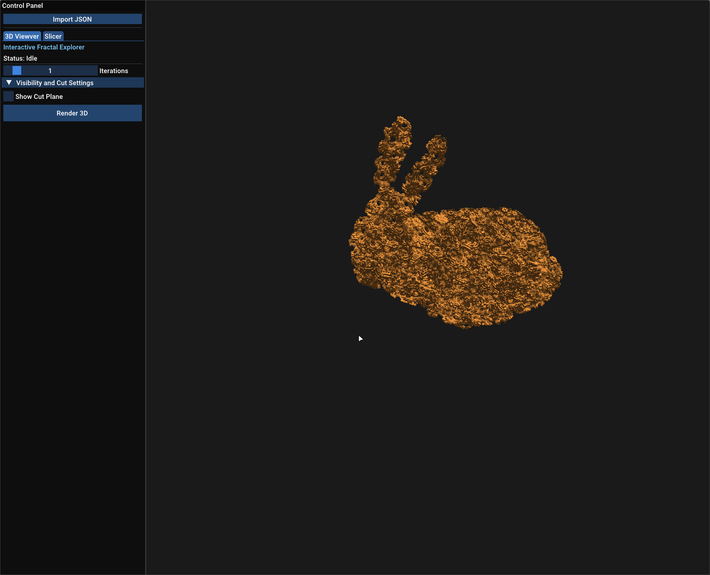
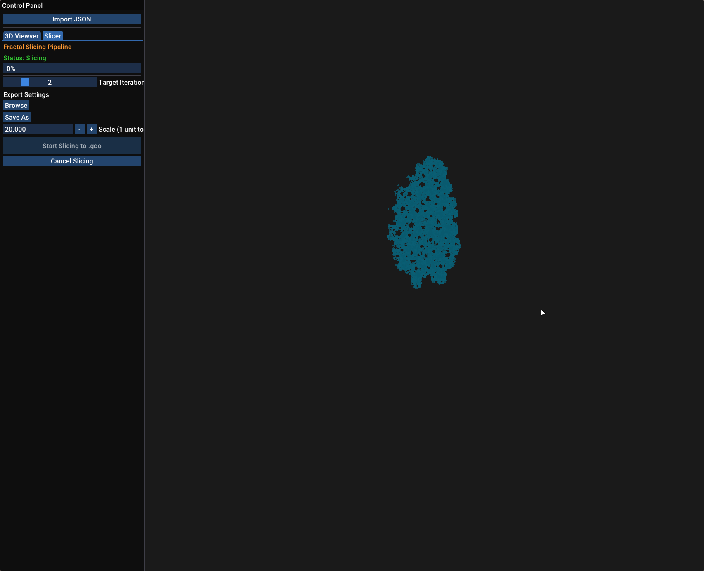
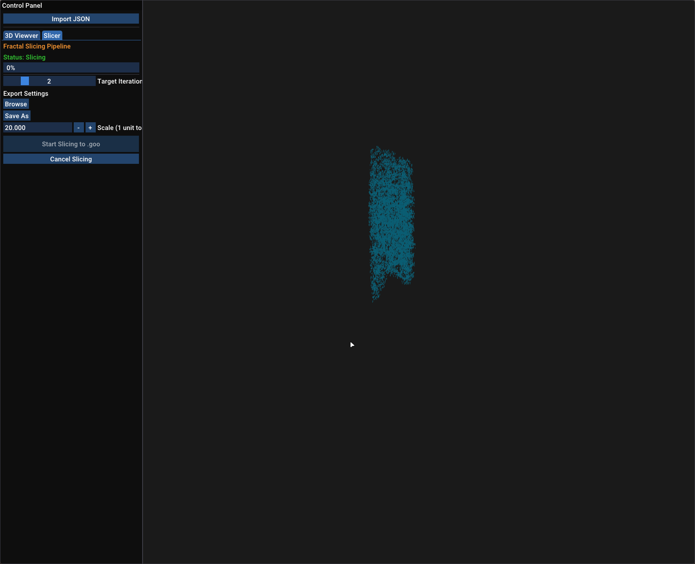
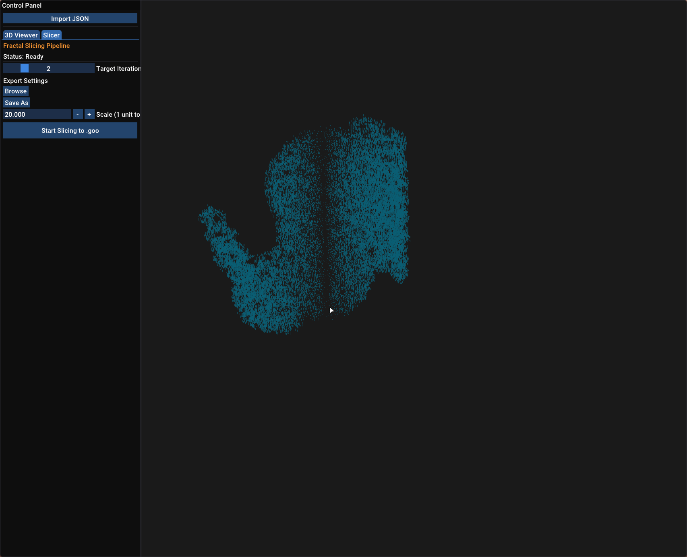
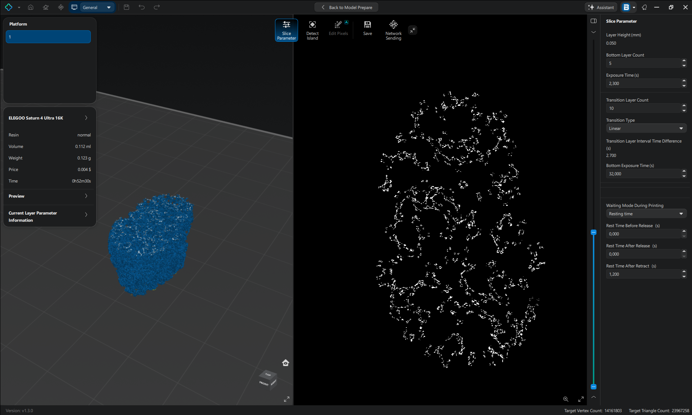

# Direct IFS Fractal Slicer

<p align="center">
  
  
  
  
</p>

A high-performance C++ slicing engine designed for the **direct export of IFS (Iterated Function Systems) fractals** into resin 3D printing formats (`.goo`) without intermediate mesh generation.

---

## The Problem & Solution

Traditional 3D printing pipelines rely on converting geometry into polygonal meshes (`.stl`, `.obj`, `.3mf`) before slicing. For high-iteration IFS fractals, this approach fails due to **exponential memory explosion**:
* At **iteration 6**, generating an explicit mesh requires tens of gigabytes of RAM.
* At **iteration 7**, memory requirements jump to **hundreds of gigabytes**, making traditional mesh slicing practically impossible on consumer hardware.

**Direct IFS Slicer** bypasses intermediate geometry entirely. By mathematically generating and evaluating fractal recursion branches directly during the slicing phase, it outputs print-ready `.goo` slice files with custom printer parameters, layer heights, and scales on the fly.

---

## Context & Credits

This project was developed by [**Egor Semenov-Tyan-Shanskiy**](https://github.com/HobbitTheCat) during an academic research internship at the [**LIB Laboratory (Laboratoire Informatique de Bourgogne)**](https://lib.ube.fr), [**Université Bourgogne Europe**](https://www.ube.fr) (France), under the supervision of **Christian Gentil**.

### Related Projects
* [**AutoFrac**](https://github.com/borisbordeaux/AutoFrac): A modeling framework developed at LIB for constructing and manipulating complex IFS fractals. Fractals generated in AutoFrac can be exported (via JSON configurations) and sliced directly using this application.

--- 

## Features & Interface

The application features a 2-step streamlined GUI build with OpenGL and ImGui:
1. **3D Preview Mode**: Real-time rendering of low-iteration fractal approximations to inspect geometry, camera orientation, and spatial bounds.
2. **Direct Slicing Pipeline**: Configurable layer-by-layer slicing engine that generates `.goo` files with applied exposure, resolution, and printer dimensions.
    
> **ChituBox**: Output `.goo` files generated by this slicer can be opened in **ChituBox** (or similar resin slicers) to preview layer masks and even reconstruct 3D voxel models for post-processing.


--- 

## Building & Installation

### Prerequisites
* **C++ Compiler**: GCC or Clang supporting C++17/C++20
* **Build Systems**: CMake (>= 3.20)
* **Libraries**: OpenGL, GLFW, GLEW, Armadillo, OpenBLAS, LAPACK, fmt, spdlog, TBB

```bash
git clone git@github.com:HobbitTheCat/FracSlicer.git
cd FracSlicer
mkdir build && cd build
cmake ..
make -j$(nproc)
```

---

## 📸 Gallery & Workflow

### 1. 3D Fractal Inspection
| 3D Model Preview |
| :---: |
|  |
| *Interactive 3D view with adjustable cut-plane parameters* |

### 2. Slicing Pipeline & Real-Time Preview
| Slicing Progress (Phase 1) | Layer Rasterization (Phase 2) |
| :---: | :---: |
|  |  |
| *Processing fractal recursion branches* | *Real-time per-layer pixel preview* |

### 3. Output & Reconstruction in ChituBox
| Export Result (`.goo`) | Voxel Mesh Reconstruction |
| :---: | :---: |
|  |  |
| *Generated slice file ready for printing* | *Reconstructed 3D voxel representation in ChituBox* |

---

## Usage
Launch the application:
```bash
./app_main
```
The workflow is split into two primary phases: **Visual Preview** and **Direct Slicing**

### Step 1: Preview & Inspection
1. Click `Import JSON` to load a fractal structure definition file (you can choose one from the provided examples in `res/fractals_json' or upload your own).
2. Adjust the Iteration slider (it is recommended to set this to $\le 2$ during preview to ensure smooth UI performance).
3. Click `Render 3D` to generate the real-time fractal mesh preview.
4. (Optional) Enable the `Show Cut Plane` checkbox to visualize the slicing plane, then adjust its orientation and offset using the dropdown settings.

### Step 2: Slicing & Direct `.goo` Export
1. Switch to the `Slicer` tab in the top navigation bar.
2. Set the target `Iteration` count for the final print (higher `iteration`s generate exponentially finer fractal details).
3. Click `Browse` under Printer Config to select a .json configuration file matching your resin printer.
    Note: To add a new printer model, create a corresponding configuration .json file and place it inside res/printer_json/.
4. Click `Save as` to set the output destination path and filename for your `.goo` file.
5. Use the `Scale` a slider for setting the conversion factor from abstract coordinates to actual dimensions (mm).
6. Click `Start Slicing to .goo`. A real-time, low-resolution per-layer preview will render during the process.

Completion: Once slicing is finished, the Start Slicing to .goo button will become active again. Your output .goo file is now ready in the specified folder and can be opened in ChituBox or transferred directly to your printer.

---

## Roadmap & Future Directions

- [ ] **Support Structure Generation**: Researching automatic support algorithms for porous IFS geometries without damaging fine details.
- [ ] **Multi-threaded Pipeline**: Further parallelizing branch evaluations across CPU/GPU compute pipelines.

> 📋 **Tasks & Ideas**: For a detailed list of feature requests, planned refactoring, and known bugs, see our [GitHub Issues](https://github.com/HobbitTheCat/FracSlicer/issues).

---

## License

* This project is licensed under the **GNU General Public License v3.0**.

### Third-Party Code & Acknowledgments

* Includes a C++ port of [msla_format v0.2.0](https://crates.io/crates/msla_format/0.2.0), originally written in Rust by [Connor Slade](https://github.com/connorslade) as part of the [mslicer](https://github.com/connorslade/mslicer) ecosystem.
    Original License: GNU General Public License v3.0

---
## Contact

Developed by Egor Semenov-Tyan-Shanskiy
- Computer Science Student & Robotics/IoT Enthusiast (France)
- GitHub: [@HobbitTheCat](https://github.com/HobbitTheCat)
